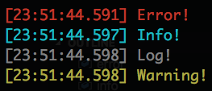

# `time-console`

Add a time stamp and color to all your console messages.



## Why?

I like coloring and time-stamping my console messages in a particular way while preserving the default `console` methods. If you are okay with [monkey patching](https://stackoverflow.com/questions/5626193/what-is-monkey-patching), checkout the more popular [`console-stamp`](https://www.npmjs.com/package/console-stamp) or [`log-timestamp`](https://www.npmjs.com/package/log-timestamp).

## Documentation

### Install

```sh
npm i --save @seanmcp/time-console
```

### Use

```js
const { log } = require('@seanmcp/time-console')()

log('Hello world!')
// -> [22:39:06:947] Hello world!
```

Four console methods are exposed:

-   `error`: red
-   `info`: cyan
-   `log`: gray
-   `warn`: yellow

### Customize

For a different date format, pass you preferred a date format string to the higher-order function:

```js
const { error } = require('@seanmcp/time-console')('YY/MM/DD HH:mm:ss')

error('Error!')
// -> [19/05/31 23:34:08] Error!
```
